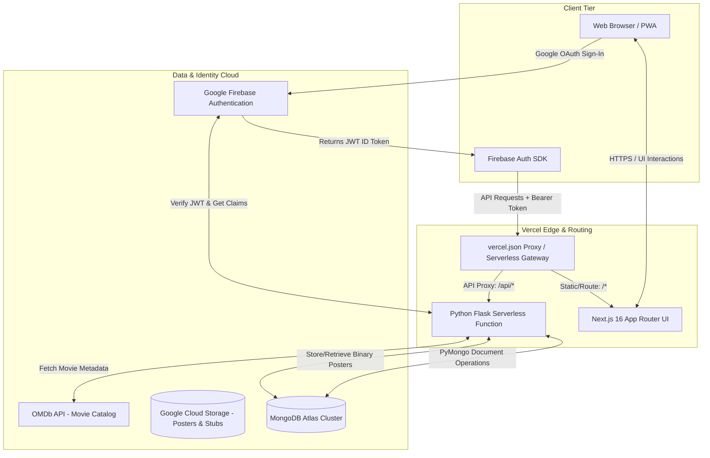
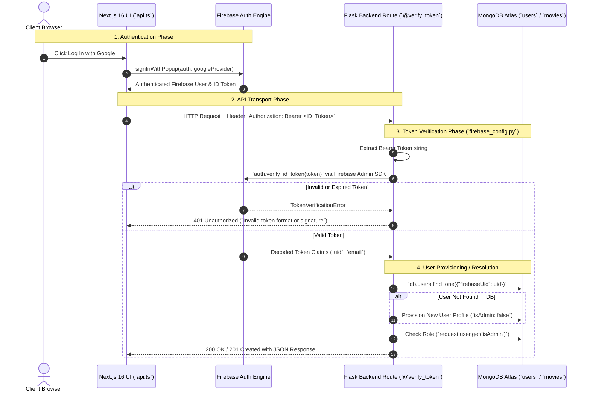

# 🏗️ Movies Tracker — System Architecture & Engineering Guide

This document describes the end-to-end architecture, data pipelines, authentication flow, and deployment topology of **Movies Tracker**.

---

## 🌐 High-Level Topology

Movies Tracker is architected as a **monorepo hybrid web application** deployed on **Vercel**, bridging a **Next.js 16 (React/TypeScript)** frontend with a **Python Flask 3.10+** API backend backed by **MongoDB Atlas** and **Google Cloud Storage**.

---

## 🔐 Request Lifecycle & Security Architecture

Every API request targeting `/api/users/*`, `/api/movies` (mutation), or `/api/theaters` (mutation) goes through a strict **multi-stage authentication and authorization pipeline**:

---

## 💾 Storage Architecture: Embedded vs. Binary

### 1. Watch History (Embedded Array pattern)
Instead of a separate `watches` collection that requires expensive joins (`$lookup`) on every page load, user watch history is stored inside the user document (`users.watchHistory` array).
- **Benefit**: Zero-latency atomic reads when loading user profiles or computing running watch totals.
- **Aggregation**: Running totals (`totalMoviesWatched`, `totalRuntimeSeconds`) are updated atomically (`$inc` operator) whenever a watch entry is inserted or deleted.

### 2. Movie Posters (Dual Storage Strategy)
- Posters fetched from OMDb (`posterUrl`) are automatically downloaded and stored as **MongoDB `Binary` blobs** inside `movie_posters` (`movieId`, `imageData`, `mimeType`).
- **Why?**: OMDb external URLs frequently expire or get rate-limited. Storing the binary blob inside MongoDB ensures permanent availability via our dedicated `/api/movies/<movieId>/poster` route without incurring external CDN bandwidth costs.

---

## ⚡ Pagination & Infinite Scroll Architecture

To handle thousands of movies efficiently:
1. **API Tier**: `GET /api/movies?skip=X&limit=20` returns sliced results along with `total: count_documents(query)`.
2. **UI Tier**: `IntersectionObserver` monitors a sentinel `
` at the bottom of the grid. When triggered, it fires `getMovies(currentSkip + 20, 20)` and appends new cards seamlessly.
