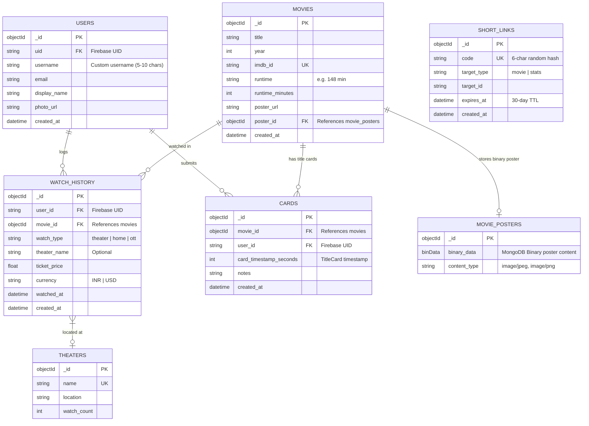

# 🎬 Movies Tracker Codebase Knowledge Graph & Architecture Map

---

## 🏗️ System Architecture & Data Flow Map

```mermaid
graph TD
    subgraph Clients["📱 Client Layer"]
        Browser["Web Browser / PWA"]
        Claude["Claude AI / LLM Assistant"]
    end

    subgraph Vercel["☁️ Vercel Edge Gateway"]
        VercelRouting["vercel.json Routing Rules"]
    end

    subgraph Frontend["🎨 Frontend (Next.js 16 App Router)"]
        UI_Pages["App Routes\n- / (Infinite Catalog)\n- /u/[username] (Public Profile)\n- /m/[code] (Movie Link)\n- /s/[code] (Stats Link)\n- /dashboard\n- /leaderboard\n- /timer"]
        UI_Components["React Components\n- AddWatchDialog\n- ShareStats\n- MovieCard\n- MovieGrid\n- Header & Nav"]
        UI_Services["API Client Services\n- firebase/auth\n- API Fetch Wrappers"]
    end

    subgraph Backend["🐍 Backend API (Python Flask 3.0)"]
        FlaskApp["app.py (Flask Gateway)"]
        
        subgraph Blueprints["Route Blueprints"]
            BP_Movies["/api/movies (Catalog & OMDb Ingestion)"]
            BP_Users["/api/users (Profiles & Auth Sync)"]
            BP_Watch["/api/watch-orders (Watch History Logging)"]
            BP_Cards["/api/cards (TitleCard Timers)"]
            BP_Stats["/api/stats (Runtime & Short Links)"]
            BP_Leaderboard["/api/leaderboard (Annual Rankings)"]
            BP_Theaters["/api/theaters (Theater Autocomplete)"]
            BP_DeviceAuth["/api/auth (Device Flow for CLI/MCP)"]
        end
    end

    subgraph MCPServer["🤖 MCP Server (TypeScript Node.js)"]
        MCP_CLI["mcp-server/src/cli.ts"]
        MCP_Core["mcp-server/src/index.ts"]
        MCP_Tools["MCP Tools (search_movies, log_watch, etc.)"]
    end

    subgraph DataServices["💾 External & Data Services"]
        FirebaseAuth["Firebase Auth (Google OAuth)"]
        MongoAtlas[("MongoDB Atlas Cluster\n- movies\n- users\n- watch_history\n- cards\n- short_links\n- watch_orders\n- movie_posters")]
        OMDbAPI["OMDb API (External Movie Metadata)"]
    end

    %% Client Routing
    Browser -->|HTTPS Request| VercelRouting
    VercelRouting -->|/* (Page Routing)| UI_Pages
    VercelRouting -->|/api/* (Serverless API)| FlaskApp

    %% Frontend interactions
    UI_Pages --> UI_Components
    UI_Pages --> UI_Services
    UI_Services -->|Bearer ID Token| FlaskApp
    UI_Services <-->|Google Sign-In| FirebaseAuth

    %% Backend routing & Auth
    FlaskApp --> Blueprints
    FlaskApp <-->|Verify ID Tokens| FirebaseAuth
    Blueprints <-->|Document CRUD & Posters| MongoAtlas
    BP_Movies <-->|Fetch Metadata| OMDbAPI

    %% MCP Flow
    Claude <-->|Stdio / SSE| MCP_Core
    MCP_CLI --> MCP_Core
    MCP_Core --> MCP_Tools
    MCP_Tools -->|API Endpoints| FlaskApp
```

---

## 🗄️ Database Schema & Entity Relationships



---

## 🔌 API Endpoint Registry

| Blueprint | Endpoint | Method | Auth Required | Description |
| :--- | :--- | :---: | :---: | :--- |
| **`movies_bp`** | `/api/movies` | `GET` | No | Paginated catalog (`page`, `limit`, `search`) |
| | `/api/movies/import` | `POST` | Yes | Ingest movie from OMDb API by IMDb ID |
| | `/api/movies/poster/<id>` | `GET` | No | Serve embedded binary movie poster |
| **`users_bp`** | `/api/users/profile` | `GET` / `PUT` | Yes | Get or update current user profile & username |
| | `/api/users/by-username/<name>` | `GET` | No | Fetch public user profile and watch stats |
| **`watch_orders_bp`** | `/api/watch-orders` | `GET` / `POST` | Yes | Query or log movie watch history entries |
| | `/api/watch-orders/<id>` | `DELETE` | Yes | Delete watch log entry |
| **`cards_bp`** | `/api/cards` | `GET` / `POST` | Optional / Yes | Fetch or record title card timestamps |
| **`stats_bp`** | `/api/stats` | `GET` | Yes | User runtime totals, theater spend & breakdown |
| | `/api/stats/short-link` | `POST` | Yes | Generate short link `/s/<code>` for stats |
| **`leaderboard_bp`**| `/api/leaderboard` | `GET` | No | Annual user watch runtime leaderboards (`2026`) |
| **`theaters_bp`** | `/api/theaters` | `GET` | No | Theater name autocomplete suggestions |
| **`device_auth_bp`**| `/api/auth/device/code` | `POST` | No | Request device code for CLI/MCP OAuth flow |
| | `/api/auth/device/token` | `POST` | No | Poll for token exchange completion |

---

## 🤖 MCP Server Architecture (`/mcp-server`)

```mermaid
graph LR
    subgraph Client["🤖 Claude Desktop / AI Client"]
        ClientCore["MCP Host"]
    end

    subgraph MCPServerProcess["📦 Node.js MCP Server Process"]
        StdioTransport["StdioServerTransport"]
        MCPServerInstance["Server ({ name: 'movies-tracker-mcp', version: '1.0.0' })"]

        subgraph ToolHandlers["Tool Execution Handlers"]
            Tool1["search_movies"]
            Tool2["log_watch"]
            Tool3["get_watch_history"]
            Tool4["get_user_stats"]
            Tool5["get_leaderboard"]
            Tool6["add_title_card"]
        end

        APIClient["Backend API Client (Axios / Fetch)"]
    end

    ClientCore <-->|JSON-RPC 2.0 via Stdio| StdioTransport
    StdioTransport <--> MCPServerInstance
    MCPServerInstance --> ToolHandlers
    ToolHandlers --> APIClient
    APIClient <-->|REST API| BackendAPI["Flask Backend API (mv.siv19.dev)"]
```



---

## 📂 Directory & Module Map

```
movies-tracker/
├── 📄 vercel.json                 # Vercel deployment & API rewrite routes
├── 📁 docs/                       # Architecture specs & OpenAPI documentation
│   ├── 📄 API_DOCS.md
│   ├── 📄 ARCHITECTURE.md
│   ├── 📄 ARCHITECTURE_MAP.md     # Visual architecture map & graph
│   └── 📄 openapi.yaml
├── 📁 backend/                    # Python Flask Serverless Backend
│   ├── 📄 app.py                  # Main Flask entrypoint & CORS config
│   ├── 📄 mongo_config.py         # PyMongo Atlas database connection
│   ├── 📄 firebase_config.py      # Firebase Admin SDK token verification
│   └── 📁 routes/                 # Modular Flask Blueprints
│       ├── 📄 movies.py           # Catalog, OMDb import, poster binary streaming
│       ├── 📄 users.py            # User profile, custom username claiming
│       ├── 📄 watch_orders.py     # Watch history CRUD & stats calculation
│       ├── 📄 cards.py            # TitleCard timing entries
│       ├── 📄 stats.py            # Analytics & short URL generator
│       ├── 📄 leaderboard.py      # Community runtime rankings
│       ├── 📄 theaters.py         # Verified theater list & autocomplete
│       └── 📄 device_auth.py      # OAuth device flow for headless clients
├── 📁 ui/                         # Next.js 16 App Router Frontend
│   ├── 📁 app/                    # App Router Pages
│   │   ├── 📄 page.tsx            # Main catalog & search feed
│   │   ├── 📁 u/[username]/       # User public watch history profile
│   │   ├── 📁 m/[code]/           # Shortened movie link redirect
│   │   ├── 📁 s/[code]/           # Shortened stats link redirect
│   │   ├── 📁 dashboard/          # Personal dashboard & logged movies
│   │   ├── 📁 leaderboard/        # Public annual leaderboard
│   │   ├── 📁 timer/              # Live TitleCard stopwatch & recorder
│   │   └── 📁 watch-history/      # Full filterable user watch timeline
│   └── 📁 components/             # Reusable UI Components
│       ├── 📄 add-watch-dialog.tsx # Watch log submission modal with theater selector
│       ├── 📄 add-movie-dialog.tsx # OMDb search & import modal
│       ├── 📄 share-stats.tsx     # Canvas / image exporter for stats card
│       ├── 📄 header.tsx          # Navigation bar with Firebase Auth state
│       └── 📄 movie-card.tsx      # Movie tile with poster, runtime & action triggers
└── 📁 mcp-server/                 # Model Context Protocol (MCP) Server
    ├── 📄 package.json            # Node.js dependencies (@modelcontextprotocol/sdk)
    └── 📁 src/
        ├── 📄 index.ts            # Standard IO MCP Server with 6 core tools
        └── 📄 cli.ts              # Interactive CLI helper for testing MCP tools
```
