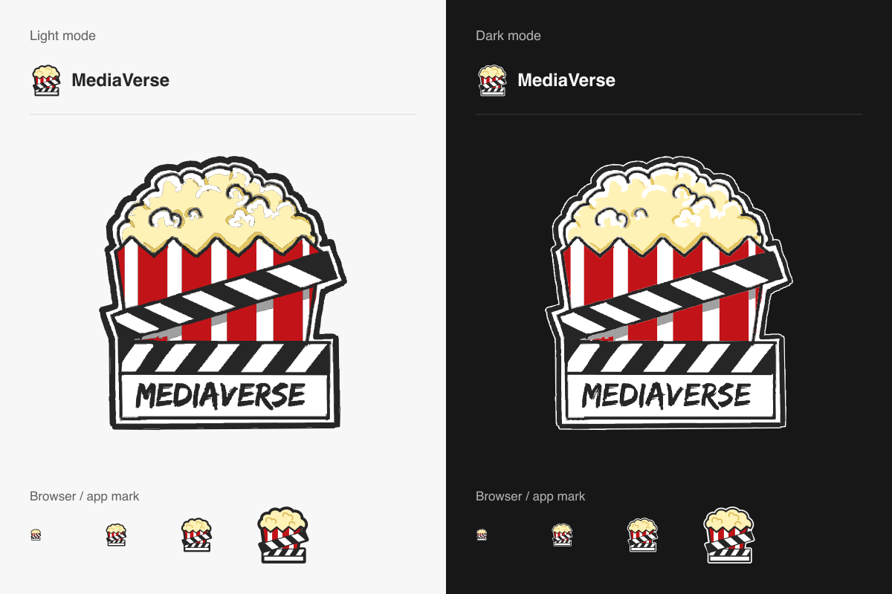

# MediaVerse branding

The full logo traces the supplied popcorn and clapperboard artwork, including
its handwritten lettering, into vector paths. It has no embedded bitmap or font
dependency. The compact mark omits the lettering and simplifies the kernels and
stripes so browser tabs and navigation remain readable.

## Assets

- `ui/public/brand/logo-light.svg` / `logo-dark.svg`: full transparent logo.
- `ui/public/brand/mark-light.svg` / `mark-dark.svg`: compact transparent mark.
- `logo-art.svg` / `mark-art.svg`: editable vector masters.
- `logo.svg` / `mark.svg`: defaults with a white rim for dark backgrounds.
- Legacy favicon, Apple, placeholder-logo, and PWA URLs remain valid and contain
  the new artwork. Maskable PWA icons have a separate, padded export.

`BrandLogo` follows the app's `.dark` class, including manual theme selection.
The SVG favicon follows the browser's system color preference. App icons have an
opaque dark background; share cards always use the dark logo.

## Regenerate exports

From `ui`, run `npm run brand:generate` after editing the masters. This uses the
existing Sharp dependency to rebuild SVG variants, PNG and ICO icons, the preview
sheet, and `lib/brand/generated.ts`. Commit these generated exports together.
Embedded PNGs let the Open Graph renderer use the logo without fetching an asset
or reading the filesystem at request time.

The optional `scripts/trace-brand-reference.py /path/to/logomv.png` reproduces the
full vector master from the original 1080px reference. It requires Python and
Pillow and uses the reference's fixed artwork crop. Ordinary brand exports need
only the Node script.

## Share previews

Every existing `opengraph-image.tsx` route has a matching `twitter-image.tsx`
route. Next.js file metadata supplies per-page image URLs and content hashes;
the root layout leaves image selection to those files. Movie, series, public
profile, watch-order, short-link, and static page cards share the same logo row.

Existing browser icon URLs and the manifest carry a brand version query, and
the service worker cache was bumped. After deployment, already-shared links may
retain a platform's cached preview until that platform fetches the page again.
